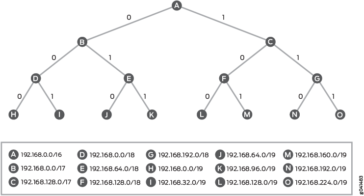
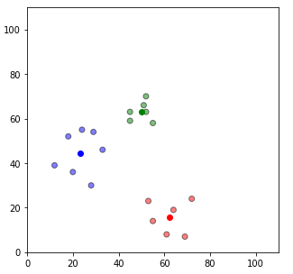
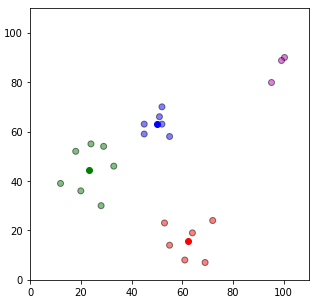

## Problem

Networking is important aspect of any enterprise, be is mission critical application or public cloud access. For any enterprise network, multiple things are important which includes, Layer1 connectivity, Layer2 and Layer3 (L3) protocols, Security, QoS and etc. L3 is important because all the customer traffic is coming/going via L3 backbone unlike private cloud/interanet deployments. Routing table would contain internal and external routes. Internal routes falls into given subnet range/prefixes and don’t change a lot. Update can vary in term of subnet range/prefixes if internet routes are imported. Although those routes stays mostly constant until there are some drastic updates received. Such drastic/huge update may be correct or wrong. It can also impact overall network performance and service quality degradation for cloud service. Detection of such updates are very tricky and CPU consuming task. Hence it is difficult to do on switching/routing hardware. Such events can lead to black-holing of traffic until detected by other means. With ever changing usage of internet and humongous internet expansion it is important to double click and see what is changing in enterprise routing domain.

## Solution approach

In general route tables are stored in PATRICIA trie. A PATRICIA trie is a special variant of the radix 2 (binary) trie, in which rather than explicitly store every bit of every key, the nodes store only the position of the first bit which differentiates two sub-trees.
We extract various features from the PATRICIA trie 
In below figure, trie depth is 3, number of nodes are 15 and leaf nodes are 8. Leaf nodes also represent the number of most preferred routes (longest prefix routes).
We can consider the mentioned value as property of given PATRICIA trie. With these 3 properties with different number of routes if we plot the clusters using clustering algorithm, we get different cluster of routes. Solution can monitor the number of clusters formed over the period of time based on changes in PATRICIA trie property. If clusters remain constant, this indicates smooth routing functions. But if clusters are added or deleted at particular timestamp, it is worth of raising alert.

Once clusters are made new routes or route updates can be classified into one of those clusters too. If routes are not classified within available cluster or it deteriorate the clusters, it is worth alerting.
We are using Supervised Machine learning method where we extract some properties from well know, industry standard data available from routing table and apply clustering techniques to find the anomaly. Supervised Machine learning gives advantage over other tradition engineering methods in terms of response time and detection performance. This also provides generic and scalable method as internet routes are increasing day by day.

Below clusters are created using KMeans clustering method using given properties. Once we add some more routes which doesn’t fall into existing cluster and forms new cluster (look at cyan colored cluster). This is indication that some routes have been added which has not been in seen in the routing table earlier.

## Code

[routing-anomaly](src/routing-anomaly-kmean.py)

## References

- https://www.bleepingcomputer.com/news/technology/centurylink-routing-issue-led-to-outages-on-hulu-steam-discord-more
- https://www.wired.com/story/bgp-route-leak-internet-outage
- https://exchange.telstra.com.au/an-update-on-our-september-30-bgp-issue
- https://www.zdnet.com/article/russian-telco-hijacks-internet-traffic-for-google-aws-cloudflare-and-others
- https://securityaffairs.co/wordpress/77971/hacking/google-traffic-bgp-leak.html