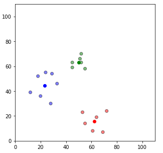

# Machine Learning for Routing Anamoly Detection

## Presenter

Ankit Sinha, Hewlett Packard Enterprise / Indepedent Reseach
Github: https://github.com/ankitsinha/Rouing-Anomaly-Classification
LinkedIn: https://www.linkedin.com/in/ankit-kumar-sinha-34484b28/

## Context

Networking is important aspect of any enterprise, be is mission critical application or public cloud access. Invalid updates to routing table are catastrophic. Such events can lead to black-holing of traffic until detected by other means. With ever changing usage of internet and humongous internet expansion it is important to double click and see what is changing in enterprise routing domain. In past invalid update to routing table has affected enterprises which lead to huge loss. Those information are readily available on internet.

## Description

We extract properties of PATRICIA trie which is used to build routing table and use it for clustering the routes to detect anomolous changes to routing table. A PATRICIA trie is a special variant of the radix 2 (binary) trie, in which rather than explicitly store every bit of every key, the nodes store only the position of the first bit which differentiates two sub-trees.
We extract various features from the PATRICIA trie. Some properties as trie depth, number of leaf nodes and total number of nodes. With these 3 properties with different number of routes if we plot the clusters using clustering algorithm, we get different cluster of routes. We can monitor the number of clusters formed over the period of time based on changes in PATRICIA trie property. If clusters remain constant, this indicates smooth routing functions. But if clusters are added or deleted at particular timestamp, it is worth of raising alert.

## Code

[routing-anomaly](src/routing-anomaly-kmean.py)

## Results, Outcomes, Conclusions

- Below clusters are created using KMeans clustering method using given properties.
- Once we add some more routes which doesn’t fall into existing cluster and forms new cluster (look at cyan colored cluster). This is indication that some routes have been added which has not been in seen in the routing table earlier.

## Python libraries used

NumPy, Colab, SciPy, Pandas, matplotlib, Kmean

## Open questions/issues

- Detection of noise and false positive
- Short lived cluster updates